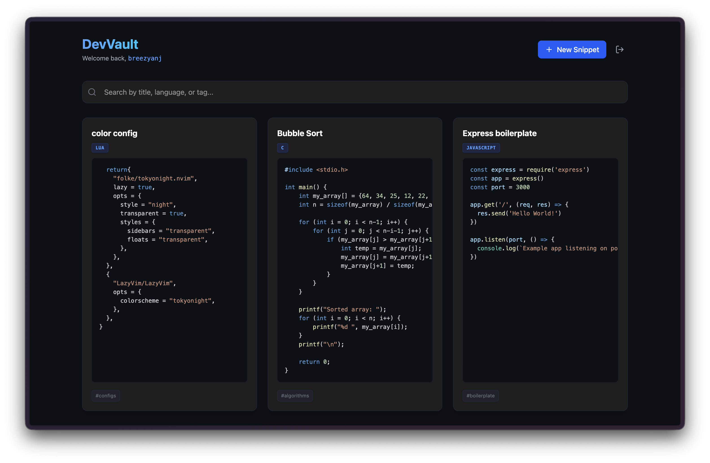
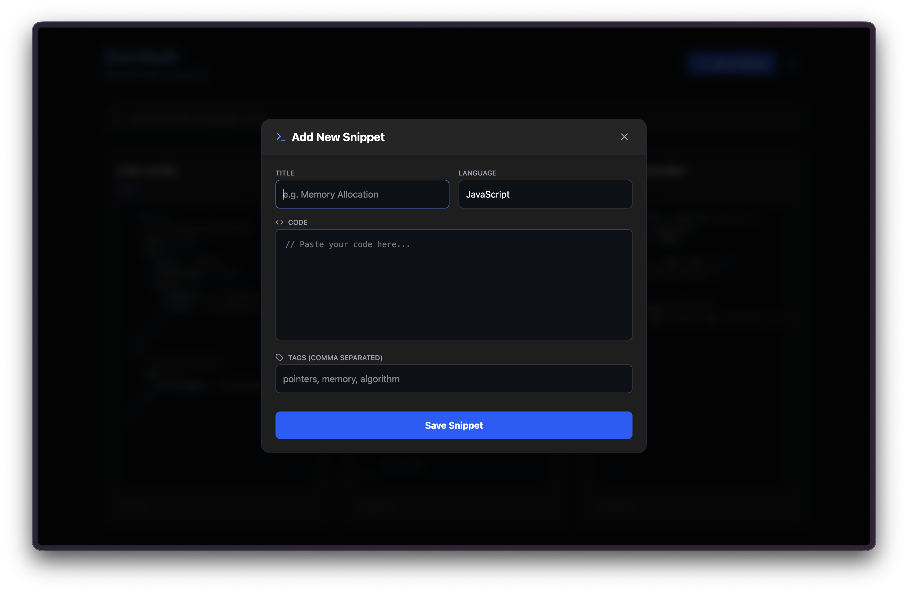
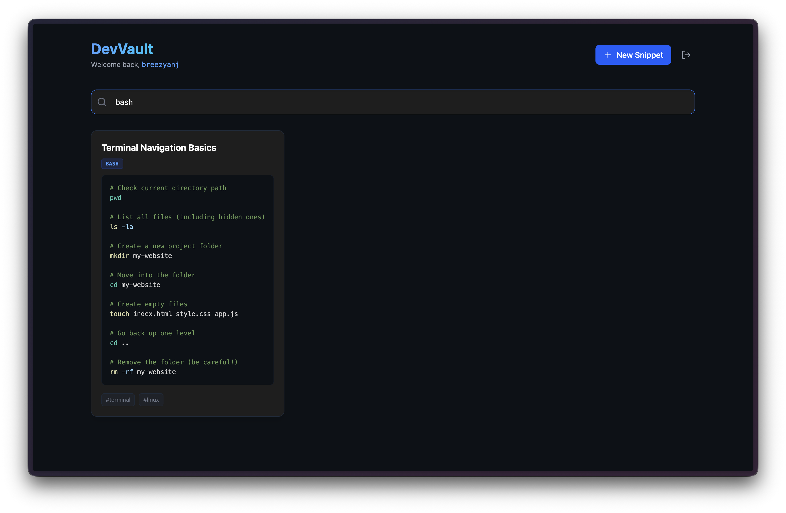

# ⚡ DevVault

**Stop losing your code.**
DevVault is a developer-first snippet manager designed to store, organize, and retrieve your code blocks instantly. Built for speed, simplicity, and syntax highlighting.

🚀 **Live Demo:** [https://devvault-psi.vercel.app](https://devvault-psi.vercel.app)

---

## 📸 Interface

|                Dashboard                 |                  Snippet                   |
| :--------------------------------------: | :----------------------------------------: |
|  |  |

|                   Search                    |
| :-----------------------------------------: |
|  |

---

## ✨ Key Features

- **🔐 Auth:** Complete authentication system using **JWT** (JSON Web Tokens) & **BCrypt**.
- **⚡ Real-Time Search:** Instantly filter snippets by title, language, or tags.
- **🎨 Syntax Highlighting:** Integrated **PrismJS** for VS Code-like syntax coloring (supports JS, Python, C++, Bash, etc.).
- **🏷️ Tagging System:** Organize your library with custom tags (e.g., `#algorithms`, `#react`).
- **📝 Full CRUD:** Create, Read, Update, and Delete snippets with a beautiful dark-mode UI.
- **📋 One-Click Copy:** Copy code blocks instantly to your clipboard.

---

## 🛠️ The Stack

Built from scratch using the **MERN** stack:

- **Frontend:** React (Vite), Tailwind CSS, Lucide React
- **Backend:** Node.js, Express.js
- **Database:** MongoDB Atlas (Mongoose)
- **Authentication:** JWT, BCrypt.js
- **Deployment:** Vercel (Frontend) + Render (Backend)

---
